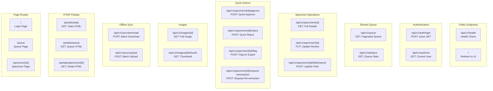
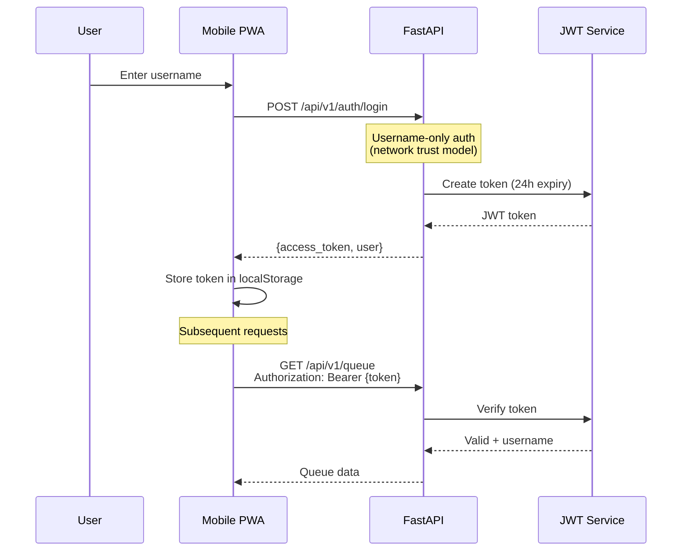
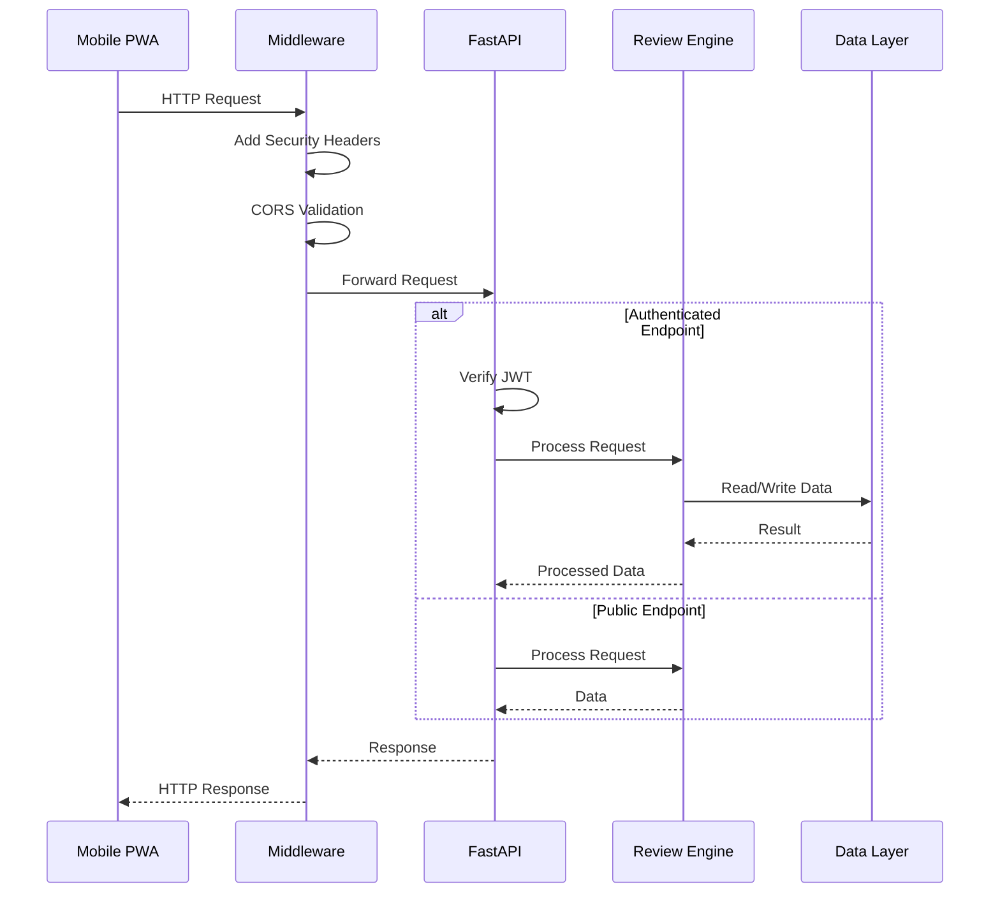

# API Endpoints

REST API structure for the Herbarium Mobile Review system, including authentication flow and HTMX partials.

## API Structure

## Authentication Flow

## Request/Response Flow

## Endpoints Reference

### Authentication

| Method | Endpoint | Auth | Description |
|--------|----------|------|-------------|
| POST | `/api/v1/auth/login` | No | Issue JWT token for username |
| GET | `/api/v1/auth/me` | Yes | Get current user info |

### Queue Management

| Method | Endpoint | Auth | Description |
|--------|----------|------|-------------|
| GET | `/api/v1/queue` | Yes | Get paginated review queue |
| GET | `/api/v1/statistics` | Yes | Get queue statistics |

### Specimen Operations

| Method | Endpoint | Auth | Description |
|--------|----------|------|-------------|
| GET | `/api/v1/specimen/{id}` | Yes | Get full specimen details |
| PUT | `/api/v1/specimen/{id}` | Yes | Update specimen review data |
| POST | `/api/v1/specimen/{id}/field/{name}` | Yes | Update single DwC field |
| POST | `/api/v1/specimen/{id}/approve` | Yes | Quick approve |
| POST | `/api/v1/specimen/{id}/reject` | Yes | Quick reject |
| POST | `/api/v1/specimen/{id}/flag` | Yes | Flag for expert review |
| POST | `/api/v1/specimen/{id}/request-reextraction` | Yes | Request re-extraction |
| POST | `/api/v1/specimen/{id}/request-region-reextraction` | Yes | Request region re-extraction |
| DELETE | `/api/v1/specimen/{id}/reextraction-regions` | Yes | Clear pending re-extractions |
| GET | `/api/v1/specimen/{id}/corrections` | Yes | Get correction history |
| POST | `/api/v1/specimen/{id}/annotation` | Yes | Save manual annotation |

### Images

| Method | Endpoint | Auth | Description |
|--------|----------|------|-------------|
| GET | `/api/v1/images/{id}` | No | Serve specimen image |
| GET | `/api/v1/images/{id}/thumb` | No | Serve thumbnail |

### Offline Sync

| Method | Endpoint | Auth | Description |
|--------|----------|------|-------------|
| POST | `/api/v1/sync/download` | Yes | Download batch for offline |
| POST | `/api/v1/sync/upload` | Yes | Upload offline changes |

### Feedback Export

| Method | Endpoint | Auth | Description |
|--------|----------|------|-------------|
| GET | `/api/v1/feedback/export` | Yes | Export corrections for ML training |

### HTMX Partials

| Method | Endpoint | Auth | Description |
|--------|----------|------|-------------|
| GET | `/partials/stats` | Yes | Statistics HTML partial |
| GET | `/partials/queue` | Yes | Queue list HTML partial |
| GET | `/partials/specimen/{id}` | Yes | Specimen detail HTML partial |

## Components Table

| Component | Location | Description |
|-----------|----------|-------------|
| Mobile API | `/src/review/mobile_api.py` | FastAPI application factory and endpoints |
| Run Server | `/mobile/run_server.py` | Alternative server with simpler setup |
| Auth Utils | `/src/review/mobile_api.py` | JWT creation and verification functions |
| Pydantic Models | `/src/review/mobile_api.py` | Request/response validation models |
| Templates | `/templates/` | Jinja2 HTMX partials |

## See Also

- [System Overview](system-overview.md) - High-level architecture
- [Review Workflow](../modules/review-workflow.md) - Status transitions
- [Mobile PWA](../modules/mobile-pwa.md) - Client-side architecture
