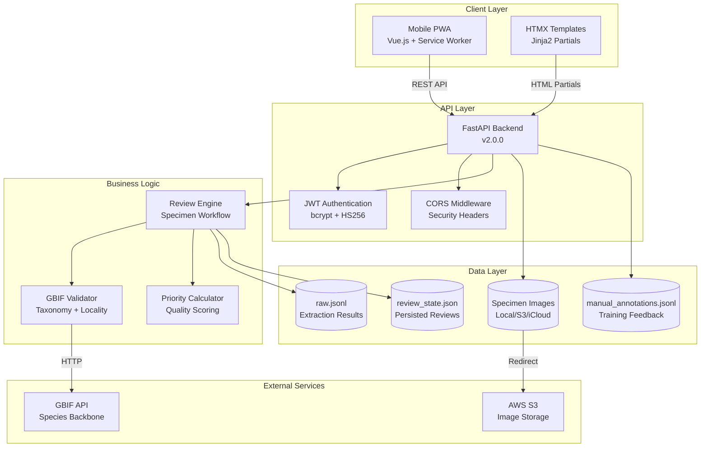

# System Overview

High-level architecture of the Herbarium Specimen Tools system, showing the Mobile PWA frontend, FastAPI backend, and data flow.

## Architecture Diagram

## Data Flow Diagram

```mermaid
graph LR
    subgraph "Extraction Pipeline"
        OCR[OCR Engine<br/>Apple Vision/Tesseract]
        EXTRACT[AI Extraction<br/>GPT/Claude]
        RAW[raw.jsonl]
    end

    subgraph "Review System"
        LOAD[Load Specimens]
        VALIDATE[GBIF Validation]
        SCORE[Quality Scoring]
        QUEUE[Review Queue]
    end

    subgraph "Mobile Review"
        MOBILE[Mobile PWA]
        REVIEW[Curator Review]
        CORRECT[Field Corrections]
    end

    subgraph "Export"
        EXPORT[DwC Archive]
        PUBLISH[GBIF Publication]
    end

    OCR --> EXTRACT --> RAW
    RAW --> LOAD --> VALIDATE --> SCORE --> QUEUE
    QUEUE --> MOBILE --> REVIEW --> CORRECT
    CORRECT --> EXPORT --> PUBLISH
```

## Components Table

| Component | Location | Description |
|-----------|----------|-------------|
| Mobile PWA | `/mobile/index.html`, `/mobile/js/app.js` | Vue.js 3 single-page application with offline support |
| Service Worker | `/mobile/sw.js` | Cache-first strategy for images, network-first for API |
| FastAPI Backend | `/src/review/mobile_api.py` | REST API with JWT auth and HTMX partials |
| Run Server | `/mobile/run_server.py` | CLI entry point with local/production modes |
| Review Engine | `/src/review/engine.py` | Core business logic for specimen workflow |
| GBIF Validator | `/src/review/validators.py` | Taxonomy and locality validation |
| Templates | `/templates/` | Jinja2 templates for HTMX partials |
| Static Assets | `/mobile/css/`, `/mobile/js/`, `/mobile/icons/` | PWA assets |

## Technology Stack

| Layer | Technology | Purpose |
|-------|------------|---------|
| Frontend | Vue.js 3 | Reactive UI components |
| PWA | Service Worker | Offline caching |
| API | FastAPI | Async REST endpoints |
| Templates | Jinja2 | Server-side HTML partials |
| Auth | JWT + bcrypt | Token-based authentication |
| Data | JSON/JSONL | Lightweight data storage |
| Images | S3/iCloud/Local | Flexible image resolution |
| Validation | GBIF API | Taxonomic verification |

## See Also

- [API Endpoints](api-endpoints.md) - Detailed API structure
- [Review Workflow](../modules/review-workflow.md) - Specimen state machine
- [Mobile PWA](../modules/mobile-pwa.md) - PWA architecture details
