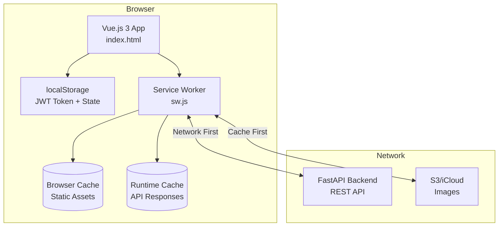
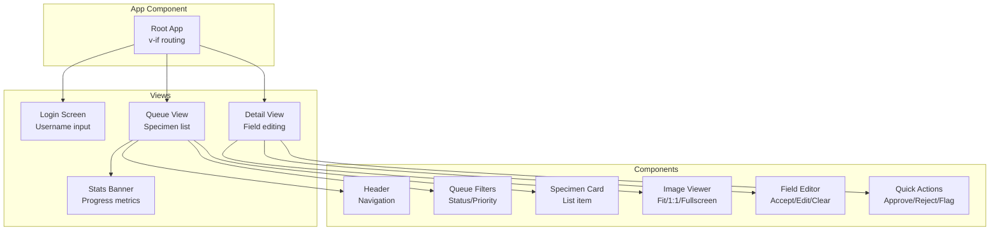
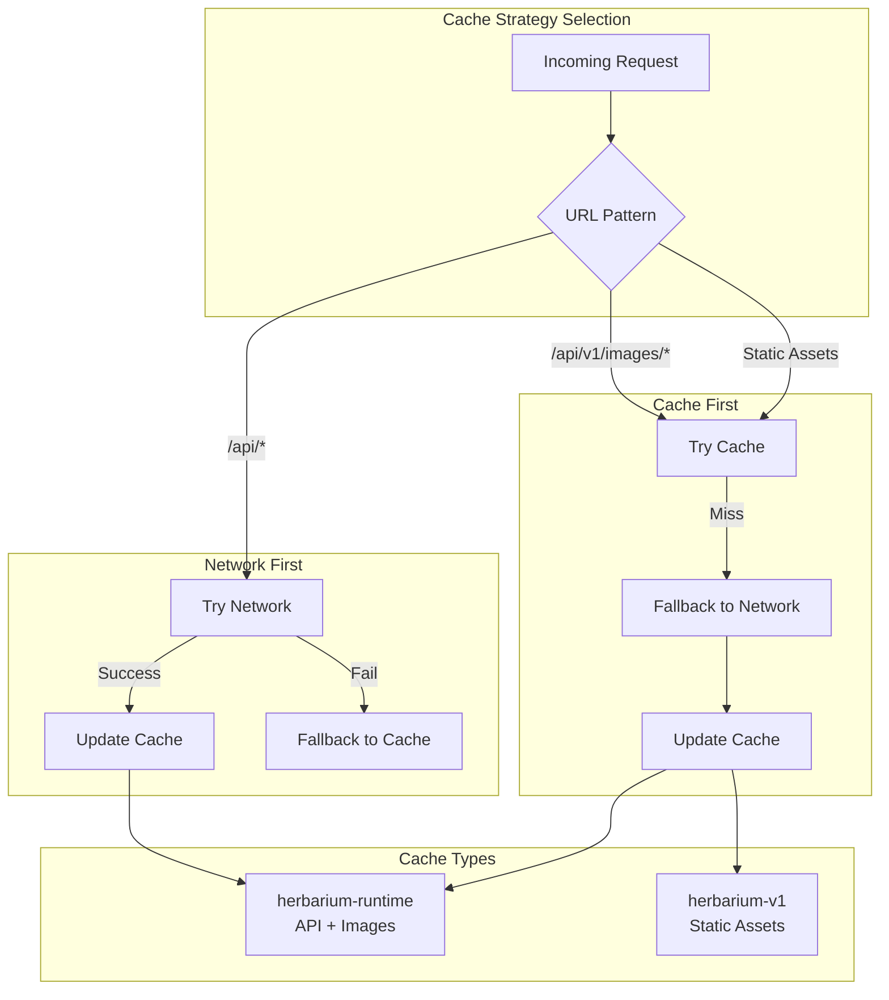
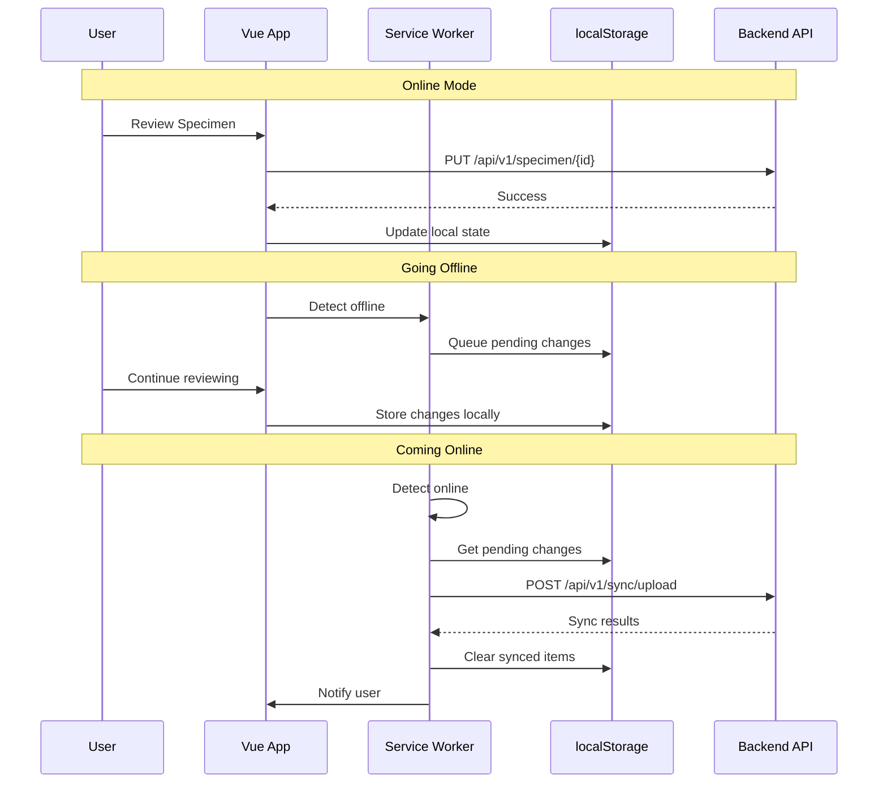
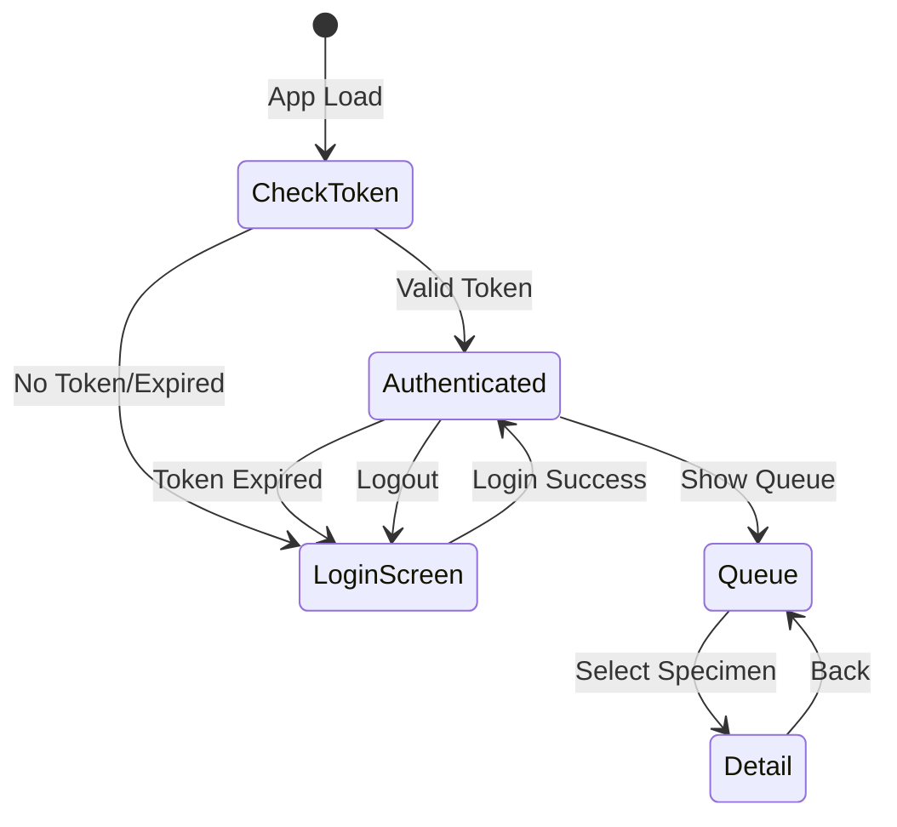

# Mobile PWA Architecture

Progressive Web App architecture for the Herbarium Review mobile interface, including Vue.js components, Service Worker caching, and offline sync.

## PWA Architecture



## Vue.js Application Structure



## Service Worker Caching Strategy



## Offline Sync Flow



## Image Viewer States

```mermaid
stateDiagram-v2
    [*] --> FIT: Image Loaded

    FIT --> ACTUAL: Tap "1:1"
    ACTUAL --> FIT: Tap "Fit"

    FIT --> FULLSCREEN: Tap Fullscreen
    ACTUAL --> FULLSCREEN: Tap Fullscreen
    FULLSCREEN --> FIT: Exit Fullscreen

    state FIT {
        [*] --> contain
        note right of contain: Image fits container
    }

    state ACTUAL {
        [*] --> scroll
        note right of scroll: Native scroll for 1:1 view
    }

    state FULLSCREEN {
        [*] --> native_zoom
        note right of native_zoom: iOS pinch-zoom fallback
    }
```

## Authentication State



## Components Table

| Component | Location | Description |
|-----------|----------|-------------|
| index.html | `/mobile/index.html` | Main HTML with Vue app template |
| app.js | `/mobile/js/app.js` | Vue.js application logic |
| api.js | `/mobile/js/api.js` | API client with auth handling |
| error-tracker.js | `/mobile/js/error-tracker.js` | Client-side error tracking |
| app.css | `/mobile/css/app.css` | Mobile-optimized styles |
| sw.js | `/mobile/sw.js` | Service Worker for offline support |
| manifest.json | `/mobile/manifest.json` | PWA manifest for installability |
| icons/ | `/mobile/icons/` | App icons (192x192, 512x512) |

## Static Assets (Cached on Install)

| Asset | Purpose |
|-------|---------|
| `/` | Root redirect |
| `/index.html` | Main application |
| `/css/app.css` | Application styles |
| `/js/api.js` | API client |
| `/js/app.js` | Vue application |
| `/manifest.json` | PWA configuration |
| Vue.js 3 CDN | Framework |

## PWA Features

| Feature | Implementation |
|---------|----------------|
| Installable | manifest.json with icons |
| Offline Support | Service Worker caching |
| iOS Optimized | apple-mobile-web-app-capable |
| Touch Optimized | Touch-friendly UI components |
| Responsive | Mobile-first CSS |
| Sync | Batch download/upload endpoints |

## Browser Compatibility

| Feature | Chrome | Safari iOS | Firefox |
|---------|--------|------------|---------|
| Service Worker | Full | Full | Full |
| Cache API | Full | Full | Full |
| PWA Install | Full | Add to Home | Limited |
| Fullscreen API | Full | Limited* | Full |

*iOS Safari uses pinch-zoom fallback for fullscreen image viewing.

## See Also

- [System Overview](../architecture/system-overview.md) - High-level architecture
- [API Endpoints](../architecture/api-endpoints.md) - Backend API structure
- [Review Workflow](review-workflow.md) - Status state machine
- [Mobile README](/mobile/README.md) - Setup and usage guide
