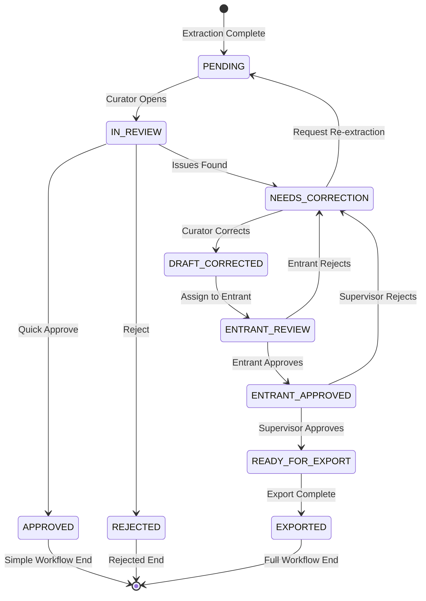
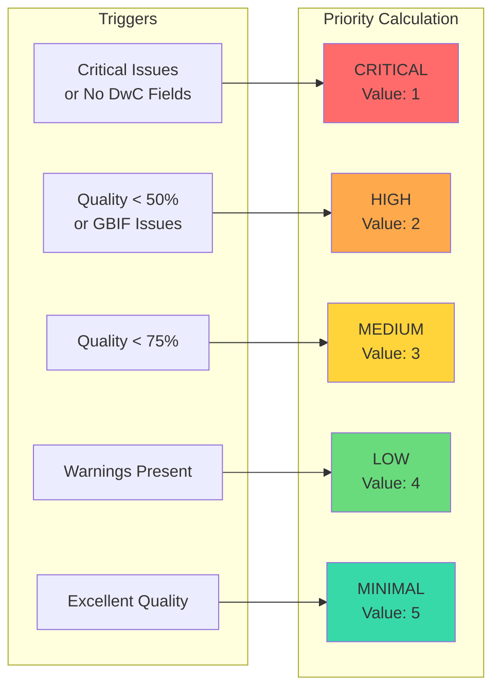
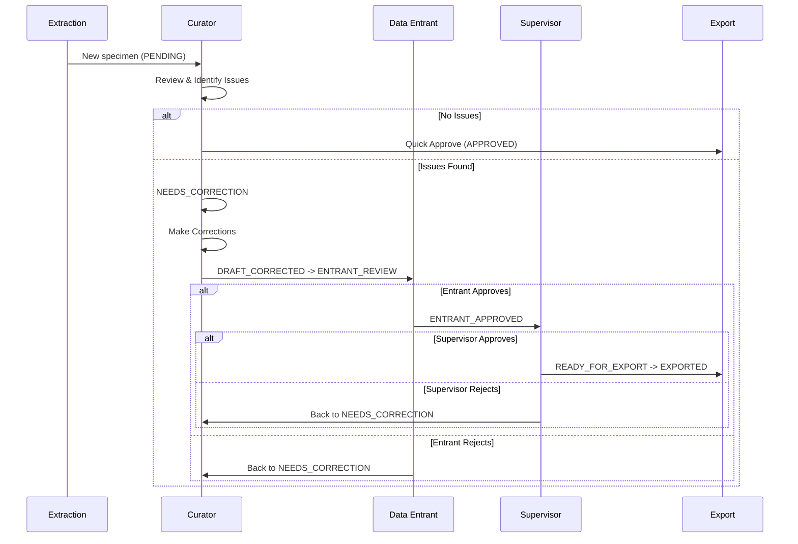
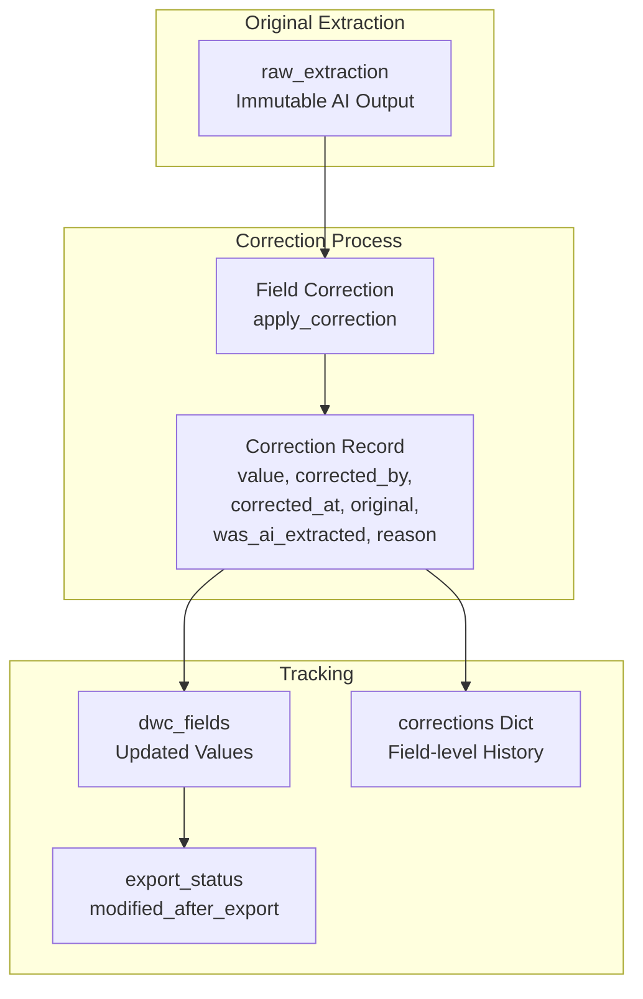
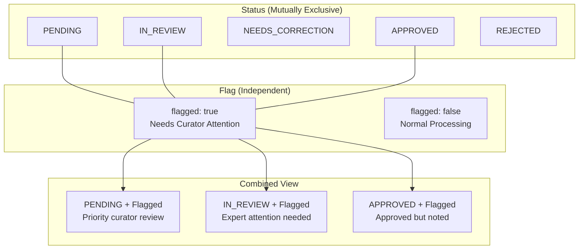
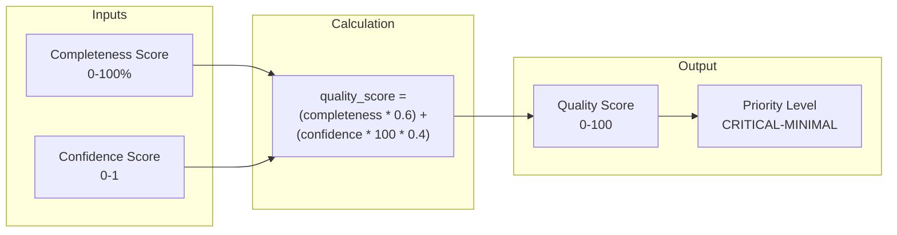

# Review Workflow

Complete state machine for specimen review, including the multi-role entrant workflow for institutional digitization projects.

## Review Status State Machine

## Review Priority Levels

## Entrant Workflow Detail

## Correction Tracking Flow

## Flag vs Status (Orthogonal Concepts)

## Quality Score Calculation

## Components Table

| Component | Location | Description |
|-----------|----------|-------------|
| ReviewStatus Enum | `/src/review/engine.py:26-39` | Status values and lifecycle states |
| ReviewPriority Enum | `/src/review/engine.py:42-48` | Priority levels (1-5) |
| SpecimenReview Dataclass | `/src/review/engine.py:51-215` | Complete specimen review record |
| apply_correction() | `/src/review/engine.py:146-173` | Apply field correction with audit |
| assign_to_entrant() | `/src/review/engine.py:216-227` | Assign specimen to data entrant |
| entrant_approve() | `/src/review/engine.py:229-241` | Entrant approval workflow |
| entrant_reject() | `/src/review/engine.py:243-255` | Entrant rejection workflow |
| supervisor_approve() | `/src/review/engine.py:257-266` | Final supervisor approval |
| calculate_quality_score() | `/src/review/engine.py:117-126` | Quality calculation |
| determine_priority() | `/src/review/engine.py:128-144` | Priority assignment |

## Status Transitions

| From | To | Trigger | Actor |
|------|-----|---------|-------|
| - | PENDING | Extraction complete | System |
| PENDING | IN_REVIEW | Curator opens | Curator |
| IN_REVIEW | APPROVED | Quick approve | Curator |
| IN_REVIEW | REJECTED | Quick reject | Curator |
| IN_REVIEW | NEEDS_CORRECTION | Issues found | Curator |
| NEEDS_CORRECTION | DRAFT_CORRECTED | Corrections made | Curator |
| NEEDS_CORRECTION | PENDING | Re-extraction requested | Curator |
| DRAFT_CORRECTED | ENTRANT_REVIEW | Assignment | Curator |
| ENTRANT_REVIEW | ENTRANT_APPROVED | Entrant accepts | Entrant |
| ENTRANT_REVIEW | NEEDS_CORRECTION | Entrant rejects | Entrant |
| ENTRANT_APPROVED | READY_FOR_EXPORT | Supervisor accepts | Supervisor |
| ENTRANT_APPROVED | NEEDS_CORRECTION | Supervisor rejects | Supervisor |
| READY_FOR_EXPORT | EXPORTED | Export complete | System |

## See Also

- [System Overview](../architecture/system-overview.md) - High-level architecture
- [API Endpoints](../architecture/api-endpoints.md) - REST API structure
- [Entrant Workflow Documentation](/docs/ENTRANT_WORKFLOW_IMPLEMENTATION.md) - Detailed implementation guide
